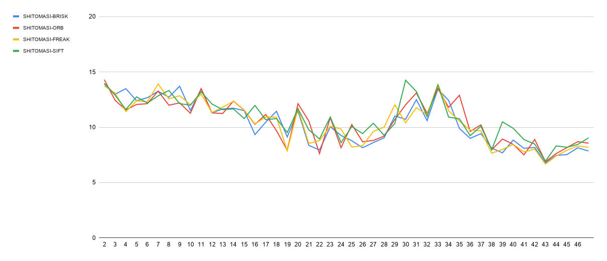

Sensor Fusion Nanodegree - 3D Object Tracking Project
======================================================

In this document we summarize the work done for the 3D Object Tracking Project,
specifying how the different points in the rubric are fulfilled.

FP.0 Mid-Term Report
--------------------

```
The writeup / README should include a statement and supporting figures / images that explain how 
each rubric item was addressed, and specifically where in the code each step was handled.
```
 
FP.1 Match 3D Objects
---------------------
```
Code is functional and returns the specified output, where each bounding box is assigned the match 
candidate with the highest number of occurrences.
```
The method matchBoundingBoxes is implemented in camFusion_Student.cpp. A high-level description of the process is as follows:
1. loop on the current boxes
2. create a vector to represent number of keypoints matches between previous boxes and a certain current box.
3. select the previous box with the maximum keypoint matches
4. concatenate the selected previuos box and the curr box to the best matches map

FP.2 Compute Lidar-based TTC
----------------------------
```
Code is functional and returns the specified output. Also, the code is able to deal with outlier 
Lidar points in a statistically robust way to avoid severe estimation errors.
```
The method computeTTCLidar is implemented in camFusion_Student.cpp. A high-level description of the process is as follows:
1. sort the previous and current lidar points.
2. calculate the interquartile range.
3. use 1.5 * IQR to filter any value far away from this min/max boundry.
4. calculate the TTC using the min value of the filter data.

FP.3 Associate Keypoint Correspondences with Bounding Boxes
-----------------------------------------------------------
```
Code performs as described and adds the keypoint correspondences to the "kptMatches" property 
of the respective bounding boxes. Also, outlier matches have been removed based on the euclidean
distance between them in relation to all the matches in the bounding box.
```
The method clusterKptMatchesWithROI is implemented in camFusion_Student.cpp. A high-level description of the process is as follows:
1. Loop on each keypoint matched pairs.
2. check if this matched keypoints in inside the targeted box.
3. concatenate the match to the box struct.

FP.4 Compute Camera-based TTC
-----------------------------
```
Code is functional and returns the specified output. Also, the code is able to deal with outlier 
correspondences in a statistically robust way to avoid severe estimation errors.
```
The method computeTTCCamera is implemented in camFusion_Student.cpp. A high-level description of the process is as follows:
1. compute distance ratios between all matched keypoints.
2. get the median value from the distance ratio.
3. calculate the TTC using median distance ratio.

FP.5 Performance Evaluation 1
-----------------------------
```
Several examples (2-3) have been identified and described in detail. The assertion that the TTC 
is off has been based on manually estimating the distance to the rear of the preceding vehicle 
from a top view perspective of the Lidar points.
```
Example 1:

In this case, we see how the effect of mm error in measurement can cause the TTC estimation to drop.
It's lidar TTC is not effected by lidar points only. But also it include the error in camera algorithm 
due to relation between camera in estimating the box. this is shown below:


Example 2:

In this case, we can infer the lack of direct measure of speed can cause some error due to the divition by time.
If we looked at the estimation below, we could infer the fluctuation in velocity.
between frames 20-21, the speed was estimated to be 1.2m/s
between frames 21-22, the speed was estimated to be 0.6m/s
between frames 20-22, the acceleration can be estimated to reach -0.6 m/s^2


FP.6 Performance Evaluation 2
-----------------------------
```
All detector / descriptor combinations implemented in previous chapters have been compared with 
regard to the TTC estimate on a frame-by-frame basis. To facilitate comparison, a spreadsheet 
and graph should be used to represent the different TTCs.
```
TTC estimate for All combination can be seen in the Graph below:

There are a lot of the wrong TTC estimations. It caused by two main reasons. The first one is a small number of keypoints. 
And the second one is the outliers.


The best performance observed based upon the steady estimation for TTC. But we can't assume which is the best in terms of TTC correctness without a reference value.

